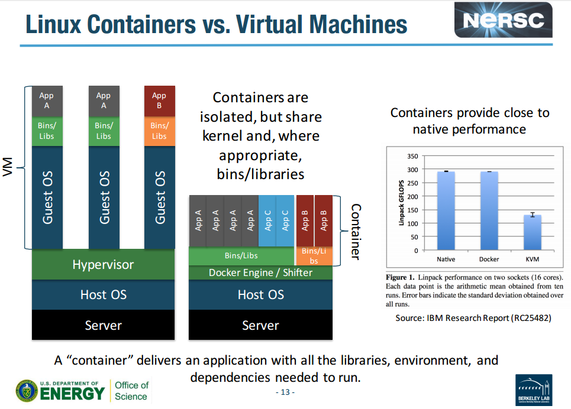
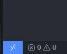
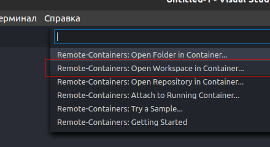
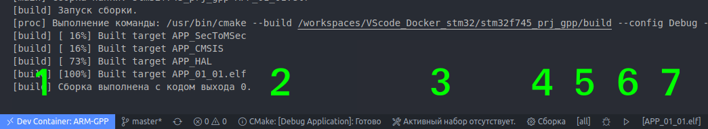
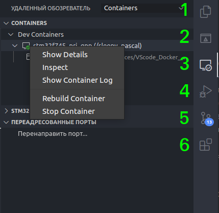
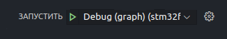
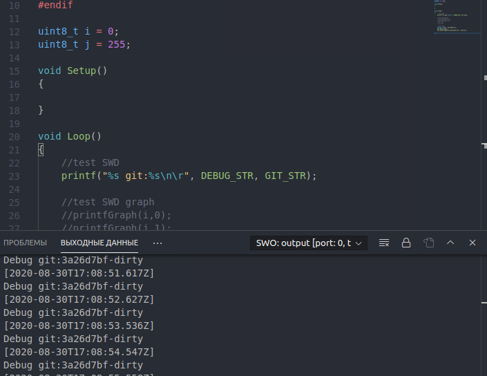
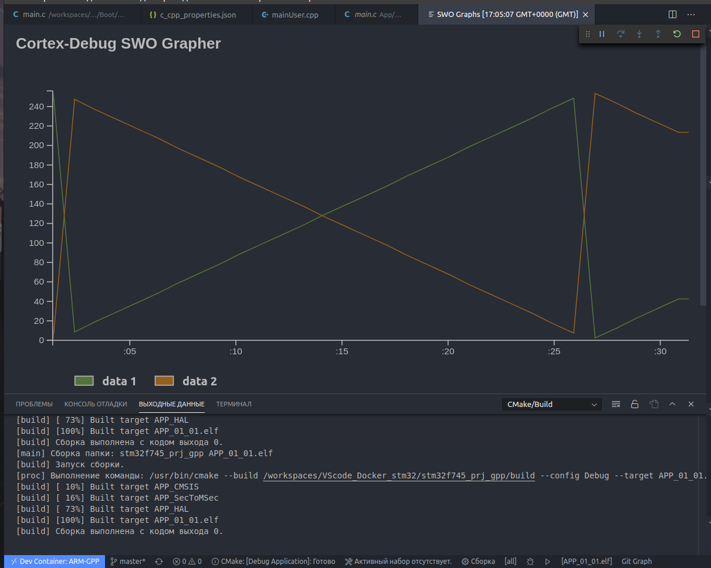

# VScode и Docker, мощный набор для разработки под Stm32

VSCode + Docker (GCC-ARM + CMake + OpenOCD) = IDE

Всех приветствую. В очередной раз речь пойдет о среде разработки под ARM. После многочисленных скитаний по разным IDE и ОС, у меня сформировался некоторый список требований к рабочему пространству. К сожалению, ни одно готовое решение не отвечало всем критерием. В процессе экспериментов, был порожден такой инструмент — набор. У вас возникнет вопрос, а почему мы должны обратить на него внимание?! В качестве аргумента, перечислю список возможностей и преимуществ.

+ Современный и удобный дизайн
+ Скорость развертывания, на новой машине
+ Возможность собирать сложные, иерархические проекты
+ Сохранить возможность генерировать код с помощью CubeMX
+ Возможность работы на таких языках как C++ и Rust
+ Изолированность рабочего пространства от системных настроек
+ Возможность установки всевозможных расширений по работе с кодом
+ Полноценная работа SWV(SWO) в режиме консоли и построение графика
+ Возможность писать скрипты, выполняем на этапе сборки так и в процессе отладки
+ Интеграция с Git
+ Open source

Заинтересовало?! Тогда продолжением.

## Как же это все работает

**Docker** - Программное обеспечение для автоматизации развёртывания и управления приложениями в средах с поддержкой контейнеризации. Позволяет «упаковать» приложение со всем его окружением и зависимостями в контейнер, который может быть перенесён на любую Linux-систему, а также предоставляет среду по управлению контейнерами. Если по простому, принцип использования очень похож на виртуальную машину, но при этом таковой не являющейся. Это позволяет избавиться от самого серьезного недостатка, ограничения производительности.



**VScode** - редактор исходного кода. Позиционируется как «лёгкий» редактор кода для кроссплатформенной разработки. Имеет **хорошую поддержку** и огромную базу расширений, при этом все Open source. Основные преимущество, это функция **Remote Development**, в других редактора её просто нет. Почитать про нее можно на [оф. сайте](https://code.visualstudio.com/docs/remote/remote-overview), изображение ниже взято именно оттуда. Если в двух словах, у нас есть возможность запустить в docker контейнере часть среды разработки, что позволяет реализовать полноценный Debug. В данной сборке, в контейнере находятся все приложения необходимые для разработки. Ваша ОС остается “чистой”. Так же это **позволяет избежать конфликта версий** и несовместимости различных модулей сборки.

 

**CMake** - кроссплатформенная система автоматизации сборки программного обеспечения из исходного кода. CMake не занимается непосредственно сборкой, а лишь генерирует файлы управления сборкой из файлов 'CMakeLists.txt'. Благодаря этому приложению мы можем создавать сложные, иерархические проекты и при этом делать это максимально автоматизированно.

Стоит отметить, все происходило на Ubuntu 20.04 c использованием китайского ST-Link2 (модифицированный) и платы собственной разработки на stm32f745

О доработке ST-Link2 можно почитать здесь: https://habr.com/ru/post/402927/

Проекты в этом репозитории **сугубо демонстрационные**, некоторый код в них абсурден.

## Подготовка рабочего пространства

В этот раз нам понадобится совсем не много пакетов…..

Установим непосредственно Visual Studio Code.

~~~bash 
sudo apt install code
~~~

Установим Docker, тут все немного сложнее. Есть детальная [инструкция от разработчика](https://docs.docker.com/engine/install/), а можно выполнить сценарий автоматической установки.

Выставим права для запуска файла, и выполняем его.

```bash
chmod +x ./docker-install-ubuntu.sh  && ./docker-install-ubuntu.sh
```

После этого необходимо, обязательно, **перезагрузить компьютер**. 

Осталось дело за малым, необходимо установить расширение “[Remote Development](https://marketplace.visualstudio.com/items?itemName=ms-vscode-remote.vscode-remote-extensionpack)” в VScode.

## Самое время, интегрировать шаблон проекта

Подключаем **ST-link в usb**, это нужно сделать **ОБЯЗАТЕЛЬНО** до запуска контейнера. Лучше даже до запуска VScode, иначе мы не сможем с ним работать из контейнера. Если вдруг, программатор был отключен во время работы, придется останавливать контейнер, подключать программатор, и заново запустить.

Нажимает на переключатель, в левом нижнем углу.



Нам необходимо открыть WorkSpace в контейнере. Ищем файл в корне проекта с расширением *.code-workspace*, затем открываем его. 



Первое развертывание контейнера занимает продолжительное время, терпеливо ждем. 

Затем, зайдем в меню “Терминал” и выполним задачу “CPU: ST-link info”. Она должна вывести информацию о вашем МК.

**На этом можно считать настройку завершенной.** Можно приступать к работе :)

## Рассмотрим основные элементы интерфейса

Нижнее меню:



1. Кнопка управления соединением с контейнером. Через не можно перемещаться между проектами.
2. Выпадающее меню выбора сборки, здесь **указываем с каким подпроектом работаем** в текущий момент. В примере есть возможность выбора APP или BOOT, Debug или Release
3. Меню выбора ToolChain, здесь мы указываем какой набор компиляторов используем в текущий момент. Рекомендую оставить значение “не указано”, в таком случае будет использовано значение по умолчанию
4. Основная кнопка, **запуск сборки** цели
5. Выбор цели сборки, практически всегда можно использовать [all]. С помощью этого пункта можно скомпилировать конкретную часть подпроекта, например драйвер или библиотеку.
6. Самые бесполезные кнопки, у меня так и не вышло заставить их работать с embedded проектом. *В будущем возможно найдется способ починить их.*
7. Выбор цели отладки, тут у нас нет выбора. Практически всегда она автоматически определяет .elf файл, который мы только что компилировали. Иногда приходится однократно клацнуть на нее.

Боковая панель:



1. Встроенный **проводник**, с его помощью можно работать непосредственно с файлами
2. В какой то степени, то же проводник, но уже по конкретному проекту. Здесь мы можем отчистить сбоку выбрать цели
3. Менеджер соединений, через него можно управлять контейнерами и их состоянием
4. **Отладка**. Именно через это меню её необходимо запускать, работает в автоматическом режиме через openocd
5. Git менеджер, показывает список изменений с предыдущего коммита
6. Менеджер расширений, с ним познакомились еще в процессе установки IDE

## Немного о структуре проекта

- App - тут хранится код основной прошивки, по совместительству cubemx проект
- App.cmake - информация для системы сборки как собирать данный подпроект
- Boot - тут хранится код кастомного загрузчика, по совместительству cubemx проект
- Boot.cmake - информация для системы сборки как собирать данный подпроект
- General - тут хранится код общий для App и Boot
- Inc/git-rev.h файл создается при сборке проекта, хронит в себе ID последнего Git commit
- build - каталог с файлами жизнедеятельности сборки, тут хранятся собранные elf, bin, т.д.
- cmake - для системы сборки
- CompilerSelectro.cmake - список компиляторов, меня его нет необходимости
- stm32f745.cmake - параметры сборки исходников **для конкретного МК**, именно здесь указывается архитектура **ядра**, определяется режим работы **FPU**
- .devcontainer - конфигурации Docker
- devcontainer.json - описывает взаимодействие VScode и Docker, так же здесь описаны расширения необходимые для работы
- Dockerfile - скрипт, который позволяет автоматизировать процесс построения контейнеров — шаг за шагом, используя при этом base образ
- .vscode - конфигурации IDE
- c_cpp_properties.json - настройки intelliSense.
- launch.json - описывает то, как запускать отладку. тут указать **путь до .svd** файла
- tasks.json - весьма объемный файл, хранит в себе все пользовательские задачи для IDE. Без необходимости не трогаем.
- openocd.cfg - настройки отладчика, именно в нем указывается **путь к *.cfg* для вашего МК** и программатора
- settings.json - общие настройки среды
- CMakeLists.txt - основной файл системы сборки, тут указывается **имя проекта**, используемые языки и контроллер
- cmake-variants.json - описывает все разновидность подпроектов.
- STM32F745ZGTx_FLASH.ld.in - файл **скопирован из cubemx** проекта, модифицирован. Добавляется на конце *.in*, если файл будет пересоздан для каждого подпроекта. В файле присутствуют переменные *${}* их мы будем определять на моменте сборки.
- .gitignore - список того что не требуется в контроле git системой

Пример проекта расположен в каталоге *stm32f745_prj_gpp*
## Поговорим об отладке

Запуск отладки осуществляется по нажатию данной кнопки, так же тут можно выбрать режим работы swo



Пример работы **SWO Console**, найти её можно во вкладке “Выходные данные”, в разделе SWO…..



Пример работы **SWO Grapher**. Окно вывода графика открывается автоматически.



## Вопросы, которые могут возникнуть

В: Почему у меня весь код подчеркнут красным?

О: За это отвечает расширение “C/C++” по совместительству IntelliSense он берет информацию из файла *build/compile_commands.json*. После первого запуска этого файла нет. В таком случае необходимо скомпилировать App
и Boot и перезапустить IDE. После этого код в подпроекте указанном как рабочий подчеркиваться красным не будет.

В: Почему IDE не видит мой ST-link?

О: Как было сказано выше ПРОГРАММАТОР нужно подключать ДО запуска контейнера, то есть до запуска IDE

В:

О: